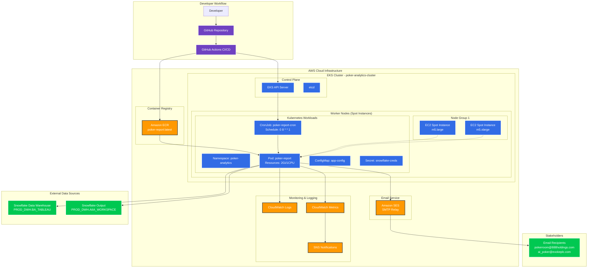

# New Architecture Design - Poker Analytics on AWS EKS

## Architecture Diagram

## Key Architecture Components

### **1. Source Code & CI/CD**
- **GitHub Repository**: Source code management
- **GitHub Actions**: Automated CI/CD pipeline
- **Build Triggers**: Push to master, scheduled runs
- **Security Scanning**: Container vulnerability checks

### **2. Container Management**
- **Amazon ECR**: Private container registry
- **Multi-stage Dockerfile**: Optimized Python container
- **Image Versioning**: SHA-based tagging
- **Security**: Base image scanning, dependency audits

### **3. EKS Cluster Architecture**
- **Cluster Name**: poker-analytics-cluster
- **Control Plane**: Managed by AWS
- **Worker Nodes**: Spot instance node groups
- **Instance Types**: m5.large, m5.xlarge (cost-optimized)
- **Availability Zones**: Multi-AZ for resilience

### **4. Kubernetes Workloads**
- **Namespace**: poker-analytics (isolation)
- **CronJob**: Scheduled weekly reports
- **Pod Specifications**:
  - Resources: 2Gi memory, 1 CPU
  - Spot tolerations
  - Graceful shutdown handling
- **ConfigMaps**: Environment configuration
- **Secrets**: Snowflake credentials

### **5. Data Pipeline**
- **Input**: Snowflake PROD_DWH.BA_TABLEAU
- **Processing**: Polars/Pandas data transformation
- **Output**: 
  - Excel reports via email
  - Snowflake AIIA_WORKSPACE table
- **Scheduling**: Weekly Monday 8 AM

### **6. Monitoring & Observability**
- **CloudWatch Logs**: Centralized logging
- **CloudWatch Metrics**: Application metrics
- **SNS Notifications**: Alert management
- **Health Checks**: Kubernetes probes

### **7. Communication**
- **Amazon SES**: Email delivery service
- **SMTP Integration**: Existing email logic
- **Recipients**: Poker operations team

## Design Improvements from Current State

### **Cost Optimization**
- **Spot Instances**: 60-90% cost reduction
- **Right-sizing**: Resource-based instance selection
- **Scheduled Scaling**: Scale down when not needed

### **Reliability Enhancements**
- **Multi-AZ Deployment**: High availability
- **Pod Disruption Budgets**: Graceful handling
- **Spot Instance Interruption**: Automatic rescheduling
- **Health Monitoring**: Proactive issue detection

### **Security Improvements**
- **IAM Roles**: Least privilege access
- **Secrets Management**: Kubernetes secrets
- **Network Policies**: Traffic isolation
- **Container Scanning**: Vulnerability detection

### **Operational Excellence**
- **Infrastructure as Code**: Kubernetes manifests
- **Automated Deployments**: GitOps workflow
- **Centralized Logging**: CloudWatch integration
- **Monitoring Dashboards**: Real-time visibility

## Migration Benefits

### **From Azure DevOps to GitHub Actions**
- Native GitHub integration
- Simplified workflow management
- Better secret management
- Cost-effective CI/CD

### **From VM-based to Kubernetes**
- Container orchestration
- Resource efficiency
- Automatic scaling
- Self-healing capabilities

### **From Fixed Infrastructure to Spot Instances**
- Significant cost savings
- Dynamic resource allocation
- Fault-tolerant design
- Optimized for batch workloads

## Implementation Phases

### **Phase 1: Foundation (Week 1)**
- ECR repository setup
- GitHub Actions configuration
- Basic Kubernetes manifests

### **Phase 2: Deployment (Week 2)**
- EKS cluster integration
- CronJob deployment
- Secret management

### **Phase 3: Monitoring (Week 3)**
- CloudWatch setup
- Alerting configuration
- Dashboard creation

### **Phase 4: Optimization (Week 4)**
- Performance tuning
- Cost optimization
- Documentation completion

This architecture provides a modern, cloud-native, cost-effective solution for the poker analytics workload while maintaining reliability and operational excellence.
